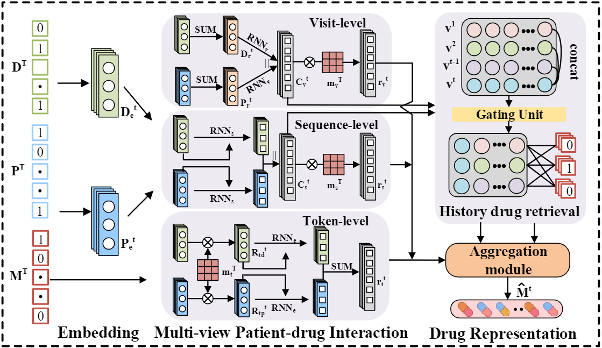

# MGRN



**This is the data and code for our paper** `Multi-view gating retrieval network for robust drug
recommendation`.

## Prerequisites

Make sure your local environment has the following installed:


* `pytorch>=1.12.1 & <=1.9`

## Datastes

We provide the dataset in the [datas](datas/) folder.

| Data                          | Source | Description                                                                                                                                       |
|-------------------------------| --- |---------------------------------------------------------------------------------------------------------------------------------------------------|
| MIMIC-III                     | [This link](https://physionet.org/content/mimiciii/1.4/) | MIMIC-III is freely-available database from 2001 to 2012, which is associated with over forty thousand patients who stayed in critical care units |
| MIMIC-IV                      | [This link](https://physionet.org/content/mimiciv/2.2/) | MIMIC-IV is freely-available database between 2008 - 2019, which is associated with 299,712 patients who stayed in critical care units            |

## Documentation

```
--src
  │--README.md
  │--data_loader.py
  │--train.py
  │--model_net.py
  │--outer_models.py
  │--util.py
  
--data
  │--MIMIC-III
  |--MIMIC-IV

```

## Train

Please run `train.py` to begin training and testing.

On a single NVIDIA® GeForce RTX™ 3080 Ti (16GB) GPU, a typical run takes hours to complete.

*TODO: More training scripts for easy training will be added soon.*


## Authors

**Email:** maryflynn5644@gmail.com \
**Site:** [GitHub](https://github.com/kyosen258)
